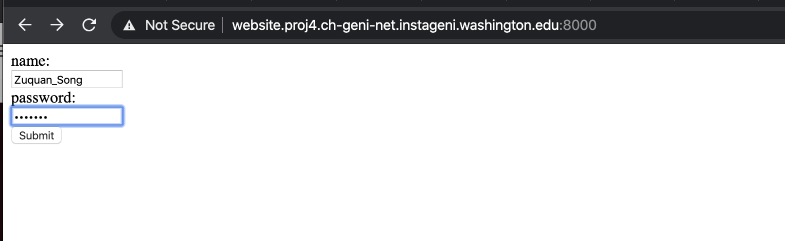
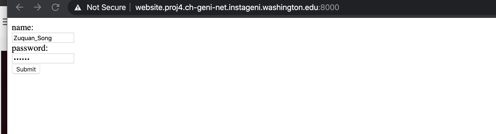
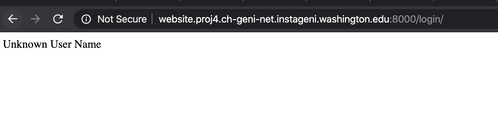
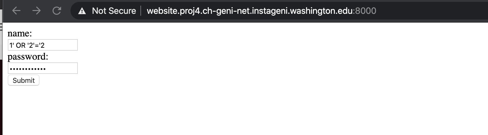
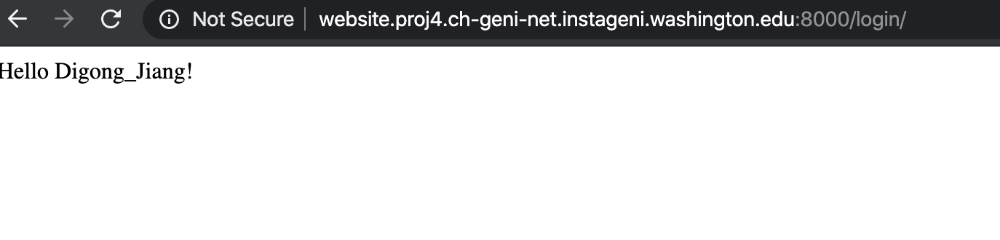

SQL Injection Attack
===

## Background

SQL injection is a code injection technique, used to attack data-driven applications, in which malicious SQL statements are inserted into an entry field for excution. [^1]In this project, we aim to have a experiment to execute SQL Injection.

## Environment Settings

- Add resources: one host (VM)
  
- Set up the host with a "publicly routable IP"
  

- Reserve resources for the site
  
- Login to the node by ssh

- Install necessary service

```
sudo apt-get update
sudo apt-get install mysql-server
sudo apt-get install python3
sudo apt-get install python3-pip
```

- Install git & Download source code

```
git clone https://github.com/zuquan-song/sql-injection-lab.git
```
- Make your work directory in sql-injection-lab

```
cd sql-injection-lab
```

- Install mysql & initialize data

```
# login mysql & create initial data
sudo mysql -uroot -p123456
mysql> create database weblab;
mysql> source scripts/InitPrivilege.sql;
mysql> source scripts/CreateUserTable.sql;
mysql> source scripts/InsertUserData.sql;
mysql> exit;
```

- Initialize python environment
```
# install packages
pip3 install django
pip3 install mysql-connector
```

- Run website service

```
cd vul_web/
python3 manage.py runserver 0.0.0.0:8000
```

## Normal Situations

### Correct Password

- Try login with 

  ```
  name: Zuquan_Song 
  password: 123456
  ```

  




### Wrong Password

- Try login with 

```
name: Zuquan_Song
password: 123457
```





## SQL Injection

- Try login with

```
name: 1' OR '2'='2
password: 1' OR '2'='2
```




<<<<<<< HEAD


- Explanation
>In <i>vul_web/model/user/login.py</i>, the sql statement to query whether the input username and password is valid is
>```
>"SELECT * FROM webuser WHERE (name = '" + user + "') and (password = '" + password + "');"
>```   
>In this case name= "1' OR '2'='2" and password= "1' OR '2'='2"
>The query sql statement is
>```
>SELECT * FROM webuser WHERE (name = '1' OR '2'='2') and (password = '1' OR '2'='2');
>```
>'2'='2' will always be true  
>And the database will return all the (username,password) pairs </br>  
>In <i>vul_web/model/user/login.py</i>, the returned (username,password) pair after the for loop will be the last pair </br>  
>According to <i>scripts/InsertUserData.sql</i>, there are only two pairs of data
>```
>INSERT INTO webuser (name, password) VALUES ('Zuquan_Song', '123456');
>INSERT INTO webuser (name, password) VALUES ('Digong_Jiang', 'easyPassword');
>```
>The returned pair is (Digong_Jiang,easyPassword) </br>   
>Finally, the attacker using 1' OR '2'='2 as username and password is regarded to login as Digong_Jiang

## Reference

[^1]: https://en.wikipedia.org/wiki/SQL_injection
