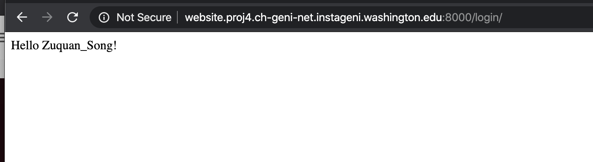

SQL Injection Attack
===

## Environment Settings

- Install necessary service

```
sudo apt-get update
sudo apt-get install mysql-server
sudo apt-get install python3
sudo apt-get install python3-pip
```

- Install git & Download source code

```
git clone https://github.com/zuquan-song/sql-injection-lab.git
```
- Make your work directory in sql-injection-lab

```
cd sql-injection-lab
```

- Install mysql & init data

```
# login mysql & create initial data
sudo mysql -uroot -p123456
mysql> create database weblab;
mysql> source scripts/InitPrivilege.sql;
mysql> source scripts/CreateUserTable.sql;
mysql> source scripts/InsertUserData.sql;
```

- Init python environment
```
# install packages
pip3 install django
pip3 install mysql-connector
```

- Run website service

```
cd vul_web/
python3 manage.py runserver 0.0.0.0:8000
```


## Normal Situations

### Correct Password

- Try login with 

  ```
  name: Zuquan_Song 
  password: 123456
  ```

  




- Try login with 

```
name: Zuquan_Song
password: 123457
```


### SQL Injection

- Try login with

```
name: 1' OR '2'='2
password: 1' OR '2'='2
```


